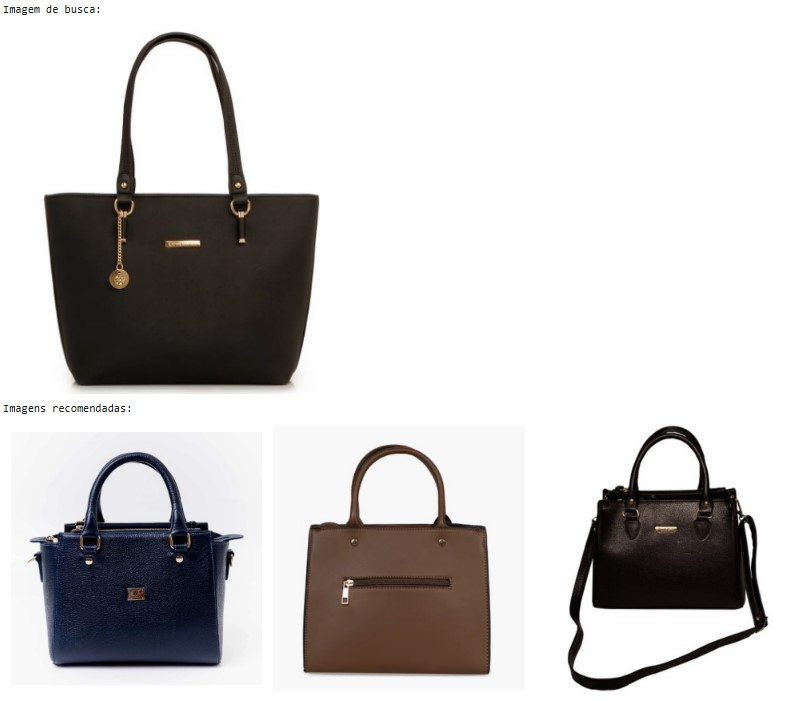
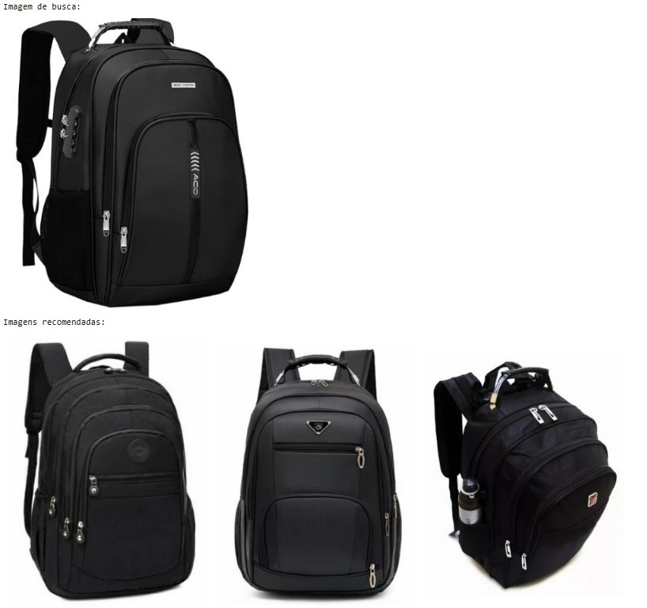

# **DIO-desafioBairesdev-recommendationSystem**
Este projeto tem como objetivo implementar um sistema de recomendação de imagens utilizando técnicas de aprendizado de máquina. O sistema foi desenvolvido com o uso do **TensorFlow** e emprega o modelo **MobileNet** para transfer learning, permitindo que o modelo aprenda a identificar e recomendar imagens semelhantes com base em uma imagem de entrada. Através do processo de **transferência de aprendizado**, o modelo pré-treinado foi ajustado para reconhecer as características específicas das imagens do conjunto de dados utilizado, facilitando a recomendação de imagens visualmente semelhantes.

O código foi estruturado para receber uma imagem de entrada e, a partir dela, gerar um conjunto de recomendações. Para isso, a técnica de embedding foi utilizada, através da biblioteca **NumPy**, que cria representações numéricas das imagens com base em suas características visualmente mais relevantes. Essas representações são comparadas entre si para identificar imagens semelhantes, que são então retornadas como recomendações. Além disso, a visualização das imagens é realizada com a biblioteca **Matplotlib**, permitindo que as imagens recomendadas sejam exibidas de forma organizada, sem os eixos X e Y, proporcionando uma experiência de visualização limpa e direta.

Este sistema de recomendação de imagens pode ser particularmente útil em plataformas de e-commerce, onde é necessário sugerir produtos semelhantes com base em uma imagem fornecida pelo usuário, mas também pode ser adaptado para diversas outras aplicações que exigem a recomendação visual, como em redes sociais, sistemas de busca visual e outros contextos. O uso de TensorFlow, MobileNet, NumPy e Matplotlib torna o sistema altamente eficiente e flexível, com a capacidade de ser facilmente customizado para diferentes tipos de dados e necessidades.

## **Resultado**

Abaixo estão os resultados gerados a partir da imagem enviada ao sistema.

